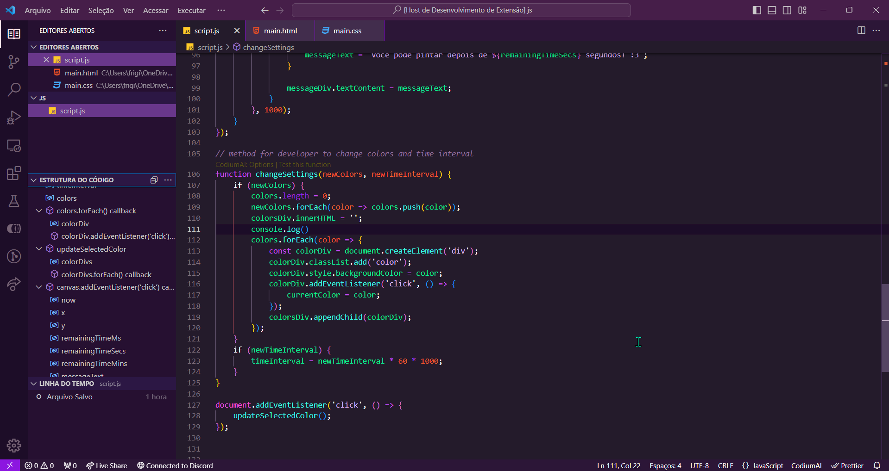

<h1 align="center">
   
  
   
  Avocado Theme, para <a href="https://code.visualstudio.com/">Visual Studio Code</a>
   
</h1>

  <strong>Um tema escuro e sofisticado para o VS Code que é tão suave quanto um abacate.</strong>

  
  
  

  <a href="#aviso">Aviso</a> •
  <a href="#instalação">Instalação</a> •
  <a href="#licença">Licença</a>

  

## Nota

O Tema Avocado é um tema escuro e elegante com um toque de verde, inspirado na suavidade e riqueza de um abacate maduro. Ele foi projetado para ser fácil para os olhos e ajudar a aumentar a produtividade.

## Instalação

1. Pressione Cmd+P(Mac), ou Ctrl + P(Windows) para abrir a paleta de comandos.
2. Cole isso— `ext install Pixelon.avocado`
3. Pressione Enter
4. Pressione Cmd+Shift+P / Ctrl+Shift+P, e digite "Tema de cores" e pressione enter.
5. Agora você deve ver o Avocado na lista. Selecione e pressione enter novamente.

## Passos Adicionais

6. Aproveite a tranquilidade das cores animadoras do Avocado. 🥑
7. Avalie com 5 ⭐ no Mercado do VSCode.

## Licença

Licença MIT | Todos os direitos reservados.
